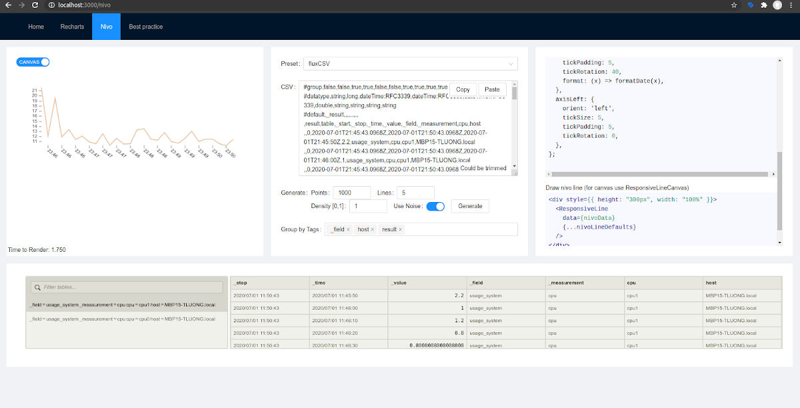
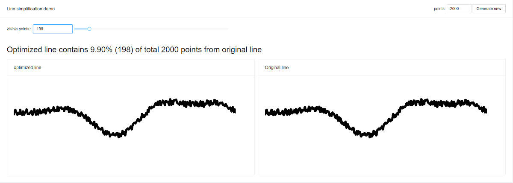
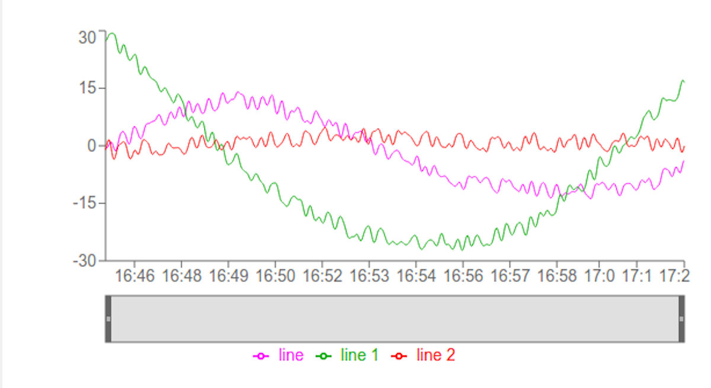

# InfluxDB Visualizations

Visualize InfluxDB query results by using the **3rd party React components**.

This project is a playground for **React front developers** that look for ways to
**visualize InfluxDB query results** by using the 3rd party React components. For
the dashboard use case, the
[Influxdata Giraffe](https://github.com/influxdata/giraffe) project is not
always an option.

Alternatively, some of the most popular graph/visualization React-based data
visualization libraries are easy to use, too.

In this repository, we present **Nivo** and **Recharts**.

## Screenshots

Figure 1: Nivo Chart Console, 1. Line chart in canvas, data, code sample and table view


Figure 2: Line Simplification Makes Performance, a small fraction of points is enough to draw the visually same line chart


Figure 3: Recharts Example, SVG-based line chart detail


## Quick Start

* Prerequisites
  * node 12 or newer
  * yarn 1.9.4 or newer

On your computer:

1. Clone this repository.
1. Run this in terminal

```sh
yarn install
yarn start
```

Open <http://localhost:3000>

## See Also

Developers also might be interested in the related topics:

* [The Influxdata IOT Center](https://github.com/bonitoo-io/iot-center-v2), a tutorial and the e2e boilerplate to your application.
* [Introduction to Giraffe](https://www.influxdata.com/blog/introduction-to-giraffe/) by Jill Pelavin.
* [The InfluxDB Javascript Client](https://github.com/influxdata/influxdb-client-js)

## License

The project is under the [MIT License](https://opensource.org/licenses/MIT).
